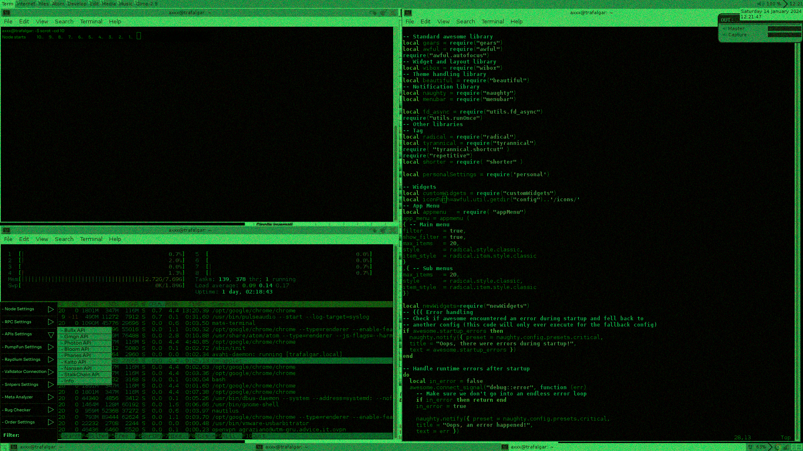

# spectraOS – First Blockchain-Based OS  

**Version:** v1.0.0  
**Ticker:**  $SPECTRA

**CA:** `524CTstkmWdmPz4B27VozNXicoRtaAZTpLnthMVgpump`

---

## Contact  

- Telegram: [t.me/spectraosai](https://t.me/spectraosai)  
- X: [https://x.com/spectraosai](https://x.com/spectraosai)  
- Website: [spectraos.ai](https://spectraos.ai)  

---

## Overview  

spectraOS is the first fully blockchain-integrated operating system, designed to streamline interaction with the Solana ecosystem. Built for degens, traders, and developers, it provides tools for real-time trading, node management, security enhancements, and on-chain data analytics—all through a minimal, terminal-inspired interface.



---

## Key Features  

1. **Custom Node Auto-Creation**  
   Automatically deploy a full Solana node, pre-configured for fast, low-latency access.

2. **Anti-MEV RPC**  
   Custom RPC endpoint with built-in anti-MEV protection to prevent transaction manipulation and front-running.

3. **Direct Validator Communication**  
   Connect directly with validators for ultra-fast, peer-to-peer transaction processing and state queries.

4. **Full On-Chain Freedom**  
   Unrestricted access to all protocol features, token data, and blockchain events without dependency on centralized services.

5. **Optimized TX Pipeline**  
   spectraOS sequences and processes your transactions for faster, reliable execution by validators.

6. **Data Indexer**  
   Sync and aggregate blockchain data in real-time, enabling rapid analytics and token tracking.

7. **Main APIs Capability**  
   - Bullx API
   - Gmgn API
   - Photon API
   - Bloom API
   - Phanes API
   - Kaito API
   - Nansen API
   - StalkChain API

---

## Installation  

Clone the repository:  
```bash
git clone https://github.com/SpectraSystem/SpectraOS.git
```

Navigate to the directory:  
```bash
cd spectraOS
```

Install dependencies:  
```bash
npm install   # or yarn install
```

Run the OS:  
```bash
npm start     # or yarn start
```

---

## Commands and Usage  

### **Basic Commands:**  

- **Swap tokens:**  
  ```bash
  spectra swap SOL to USDC
  ```  

- **Check node status:**  
  ```bash
  spectra node status
  ```  

- **Monitor validator:**  
  ```bash
  spectra validator monitor
  ```

### **Configuring RPC:**  

Customize your RPC settings in the config file (`config/rpc.json`).  
By default, spectraOS deploys a secured RPC endpoint with anti-MEV protection.

---

## Contributing  

Feel free to submit pull requests or open issues to improve spectraOS. We welcome contributions to expand functionality, optimize performance, and strengthen security.

---

## License  

This project is licensed under the **MIT License**. See the `LICENSE` file for more details.
